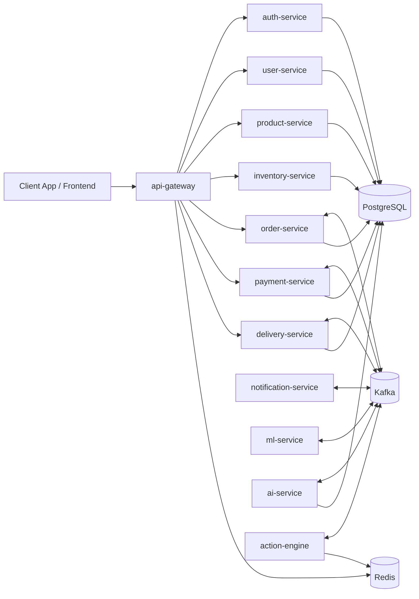
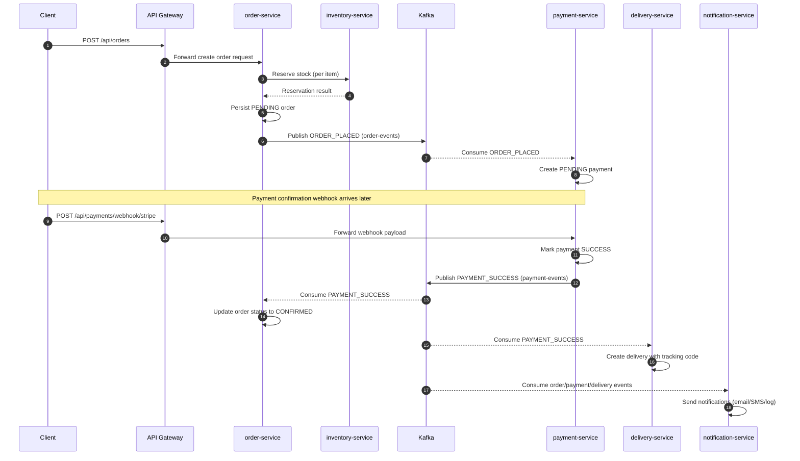
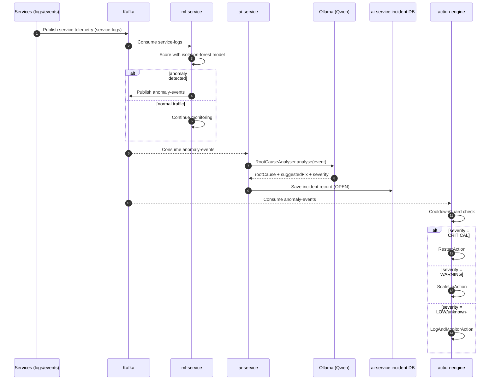

# Architecture Overview

This document explains the runtime architecture of the `Self-Healing Ecommerce Platform` and how business and self-healing flows move across services.

## 1) System Context

The platform is split into independent Spring Boot microservices behind `api-gateway`, backed by Kafka and stateful stores.

- Public entry point: `api-gateway`
- Domain services: `auth`, `user`, `product`, `inventory`, `order`, `payment`, `delivery`, `notification`
- Self-healing services: `ml-service`, `ai-service`, `action-engine`
- Data and infra: PostgreSQL, Redis, Kafka, Elasticsearch

## 2) High-Level Components

## 3) Kafka Topics Used

Defined/used by services and `commons` topic configuration:

- `service-logs`
- `anomaly-events`
- `order-events`
- `payment-events`
- `delivery-events`

## 4) Order Lifecycle Sequence

This is the event-driven order-to-delivery flow implemented in `order-service`, `payment-service`, and `delivery-service`.

## 5) Self-Healing Sequence

This is the anomaly detection and action loop implemented by `ml-service`, `ai-service`, and `action-engine`.

## 6) Failure Domain Notes

- A failure in one business service does not require a full platform restart.
- Kafka decouples producers and consumers, reducing direct synchronous dependency chains.
- `ai-service` requires reachable Ollama endpoint; if unavailable, anomaly analysis degrades.
- `action-engine` uses cooldown logic to reduce repeated remediation loops.

## 7) Deployment Views

- Local: `docker-compose.yml`
- Kubernetes: `k8s-deploy/k8s/` manifests
- Image build scripts: `k8s-deploy/build-images.ps1` and `k8s-deploy/build-images.sh`

## 8) Suggested Next Docs

- `docs/RUNBOOK.md`: incident response and operator commands
- `docs/ADR/`: architecture decision records for key tradeoffs
- `docs/API.md`: full request/response contracts by service

